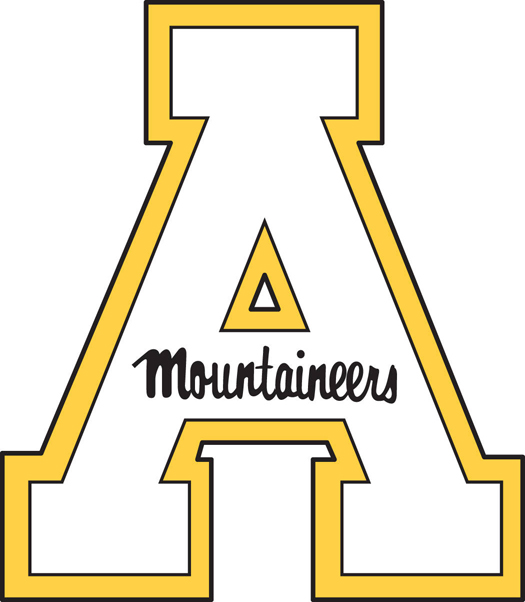

# Carly Roland 
#### **Boone, NC 28607 | (984)-238-5969**
#### **rolandce@appstate.edu** 

_____________

## Education
##### Bachelor of Science, [Geography & Geographic Information Science (GIS) Certification](https://geo.appstate.edu/)
##### Appalachian State University | Boone, NC, USA
##### 3.8 GPA, Deans List 4 Semesters, Chancellors List 2 Semesters
##### Expected: May 2024

_____________

## Skills
- Data research, processing, and analysis
- Able to gather, interpret, and map field information effectively
- Strong background in cartographic design
- Proficient in ArcGIS Pro, ENVI, and Adobe Illustrator
- Well-versed in communicating geographic information

_____________

## Related Course Work
- Cartographic Design 
- Geographic Information Science (GIS)
- Geospatial Data and Analysis
- Food Security
- Quantiative Data (Statistics)
- Human and Physical Geography

_____________

## Experience
##### **CARY, NC: *05/2023 - 08/2023***
##### **Environmental Compliance Aide | [Aqua America](https://www.aquawater.com/)**
- Assisted in the Lead and Copper Rule Sampling Program
- Distributed and collected test kits across the greater Wake County area
- Utilized GIS programs, especially ArcExplorer, to map sampling attributes

##### **RALEIGH, NC: *12/2022 - present***
##### **Field Technician | [Sustainable Landscaping Solutions](https://www.facebook.com/SustainableLandscapingSolutionsNC/)**
- Assisted in the planning and installation of suburban rain gardens
- Conducted residential site visits
- Social media management

##### **HOLLY SPRINGS, NC: *03/2018 - 10/2018***
##### **Lifeguard | [Aquatic Management Group](https://www.aquaticmanagementgroup.com/)**
- Red Cross lifeguard training: CPR, AED, First Aid
- Administered minor first aid
- Crowd management of around 75 people